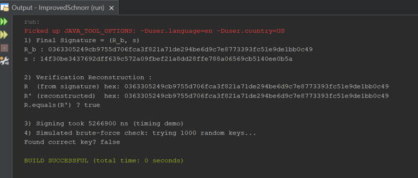

# Enhanced-Schnorr-Digital-Signature

## Overview
An enhanced implementation of the Schnorr Digital Signature Scheme using Java and the Bouncy Castle cryptography library. The project incorporates SHA3-256 hashing, deterministic nonce generation, public key binding, canonical point encoding, and domain separation to improve security while aligning with the National Cryptographic Standards published by the Saudi National Cybersecurity Authority (NCA).

## Features
- Elliptic Curve Cryptography (secp256k1)
- SHA3-256 hashing
- Deterministic nonce generation (HMAC-DRBG)
- Public key binding
- Canonical compressed point encoding
- Domain separation
- Signature generation
- Signature verification
- Designed with reference to the National Cryptographic Standards published by the Saudi National Cybersecurity Authority (NCA)

## Technologies
- Java
- Bouncy Castle
- Elliptic Curve Cryptography (ECC)
- SHA3-256

## Requirements
- Java
- Bouncy Castle library

## Note
This project was developed as part of a university cryptography project. The implementation was designed with reference to the National Cryptographic Standards published by the Saudi National Cybersecurity Authority (NCA).

## How It Works

The implementation demonstrates the complete workflow of an enhanced Schnorr Digital Signature scheme:

1. Generates a deterministic nonce using an RFC6979-style HMAC-DRBG.
2. Creates a digital signature using the private key and SHA3-256 hashing.
3. Verifies the signature by reconstructing the elliptic curve point and comparing it with the original signature.
4. Measures the execution time of the signing process.
5. Demonstrates resistance to simple brute-force attempts through a simulated key search.

The sample output included in this repository shows each stage of the signing and verification process.

## Sample Output

